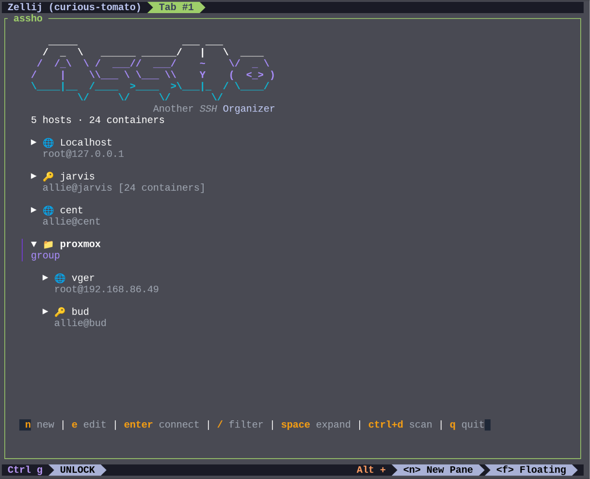

# Assho (A Simple SSH Interface)

## Screenshot



Assho is a terminal-based SSH session manager built with Go and Bubble Tea. It allows you to save, manage, and quickly connect to your SSH hosts without remembering IP addresses or flags.

## Installation

### Option 1: One-Line Install (Recommended)
Installs to `/usr/local/bin` and runs immediately:
```bash
curl -sL https://raw.githubusercontent.com/allisonhere/assho/main/install.sh | bash
```

### Option 2: Go Install
```bash
go install github.com/allisonhere/assho@latest
```
*Make sure `~/go/bin` is in your `PATH`.*

### Option 3: Install from Source (System-wide)
To install `assho` to `/usr/local/bin` so it's available everywhere:

```bash
git clone https://github.com/allisonhere/assho.git
cd assho
sudo make install
```

### Option 4: Manual Build
You can build the binary for your specific OS:

```bash
# Linux / macOS
go build -o assho main.go
```

## Usage

Run the tool:
```bash
assho
```

### Controls

**Dashboard (List View):**
- `n`: **New** session.
- `e`: **Edit** selected session.
- `d`: **Delete** selected session.
- `Enter`: **Connect** to selected session.
- `/`: **Filter** list (search).
- `q`: **Quit**.

**Form (Add/Edit):**
- `Tab` / `Down`: Next field.
- `Shift+Tab` / `Up`: Previous field.
- `Ctrl+t`: **Test Connection** (tries to connect and exit).
- `Tab` to **Pick** on Identity File, then `Enter`: **File Picker**.
- `Enter`: Save (if on last field) or Next field.
- `Esc`: Cancel.

## Configuration

Sessions are stored in `~/.config/assho/hosts.json`.
