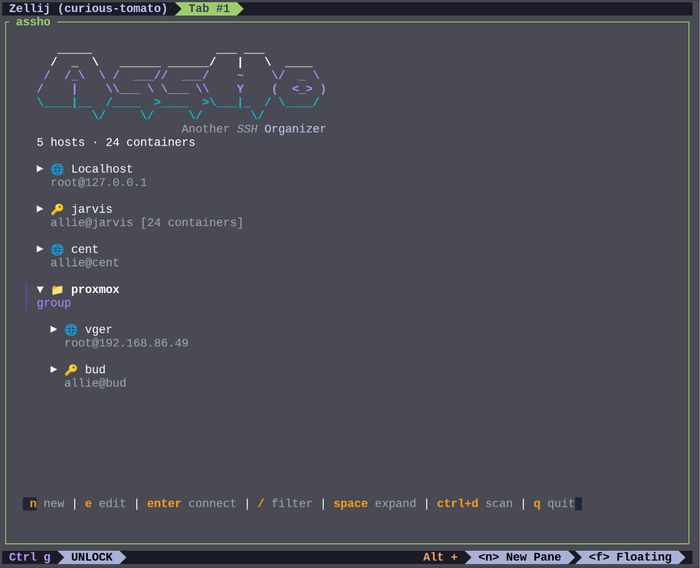

<p align="center">
  
</p>

<h1 align="center">Assho</h1>

<p align="center">
  <strong>A</strong>nother <strong>SSH</strong> <strong>O</strong>rganizer<br>
  <em>A fast, beautiful TUI for managing and connecting to your SSH hosts.</em>
</p>

<p align="center">
  <a href="https://github.com/allisonhere/assho/releases"></a>
  <a href="https://opensource.org/licenses/MIT"></a>
  <a href="https://github.com/allisonhere/assho"></a>
</p>

---

Stop typing `ssh root@192.168.1.47 -p 2222 -i ~/.ssh/id_rsa` from memory. Assho gives you a searchable, organized dashboard for all your servers — with one-key connect.

## Features

- **Instant connect** — select a host and hit Enter. SSH hands off immediately; the TUI exits cleanly.
- **Connection history** — press `h` to see your recently connected hosts and reconnect instantly. Last-connected time is shown inline on each host.
- **ProxyJump support** — specify a bastion/jump host per server; it's passed straight to SSH's `-J` flag.
- **Port forwarding** — configure a local tunnel per host (e.g. `5432:localhost:5432`); passed to SSH's `-L` flag automatically.
- **Docker container access** — expand any host to discover and shell into its running containers. Container lists auto-refresh every 30 seconds; press `Ctrl+D` to force an immediate re-scan.
- **Host groups** — organize servers into collapsible, reorderable groups (prod, staging, homelab, etc.).
- **Pinned hosts** — pin frequently used hosts with `p`; they float to the top of the list under a ★ Pinned header.
- **Notes** — attach a free-text note to any host (shown truncated in the list).
- **Duplicate host** — clone any host with `c` and tweak the copy, great for similar servers.
- **SSH config import** — pull hosts in from `~/.ssh/config` with `i`.
- **Non-interactive CLI** — connect, test, or list hosts without launching the TUI (see [CLI Usage](#cli-usage)).
- **Fuzzy search** — type `/` and filter across all hosts and groups by alias or hostname.
- **Connection testing** — verify connectivity before saving with `Ctrl+T`.
- **Identity file picker** — browse and select SSH keys with a built-in file picker.
- **Secure password storage** — passwords stored in your OS keychain (macOS Keychain / Linux `secret-tool`), never in plaintext.
- **Cross-platform** — Linux (amd64/arm64) and macOS (Intel/Apple Silicon).

## Installation

### One-Line Install (Recommended)

```bash
curl -sL https://raw.githubusercontent.com/allisonhere/assho/main/install.sh | bash
```

### Go Install

```bash
go install github.com/allisonhere/assho@latest
```

> Make sure `~/go/bin` is in your `PATH`.

### From Source

```bash
git clone https://github.com/allisonhere/assho.git
cd assho
sudo make install
```

## Usage

```bash
assho                    # launch the TUI
assho --version          # print version
```

### CLI Usage

```bash
assho list               # print all hosts as a table
assho connect <alias>    # connect directly, no TUI
assho test <alias>       # test connectivity, exits 0/1
```

### Keybindings

#### Dashboard

| Key | Action |
|---|---|
| `Enter` | Connect to selected host |
| `n` | New host |
| `e` | Edit selected host |
| `c` | Duplicate selected host |
| `d` | Delete (press twice to confirm) |
| `p` | Pin / unpin host |
| `Space` | Expand/collapse host containers |
| `→` | Expand host or group (auto-scans Docker if empty) |
| `←` | Collapse host or group |
| `Ctrl+D` | Force re-scan Docker containers immediately |
| `/` | Filter / search |
| `h` | Recent connection history |
| `i` | Import hosts from `~/.ssh/config` |
| `Shift+↑` / `Shift+↓` | Reorder hosts / groups |
| `g` | Create group |
| `r` | Rename selected group |
| `d` / `x` | Delete group (press twice to confirm) |
| `a` | About |
| `q` | Quit |

#### History

| Key | Action |
|---|---|
| `Enter` | Connect |
| `e` | Edit host |
| `h` / `Esc` / `q` | Back to dashboard |

#### Add / Edit Form

| Key | Action |
|---|---|
| `Tab` / `↓` | Next field |
| `Shift+Tab` / `↑` | Previous field |
| `Enter` | Advance to next field, or save on the `Notes` field |
| `Enter` | Open file picker (when the `Pick` control beside `Key File` is focused) |
| `←` / `→` | Cycle group selection |
| `Ctrl+T` | Test connection and show status in the form sidebar |
| `Esc` | Cancel |

On wider terminals, the add/edit screen renders as a main form with a side panel for actions and status. On narrower terminals, it falls back to a stacked layout.

### Form Fields

#### ENDPOINT

| Field | Description |
|---|---|
| Alias | Friendly name shown in the list |
| Hostname | IP address or hostname |
| User | SSH username |
| Port | SSH port (default: 22) |

#### AUTH

| Field | Description |
|---|---|
| Key File | Path to identity file; use the `Pick` button to browse |
| Password | Stored in your OS keychain, not in the config file |
| Fwd. Agent | Set to `yes` to enable SSH agent forwarding (`-A`) |

#### ADVANCED

| Field | Description |
|---|---|
| ProxyJump | Jump host in `[user@]host[:port]` format, passed to SSH's `-J` |
| LocalFwd | Port tunnel in `local:host:remote` format, passed to SSH's `-L` |

#### ORGANIZATION

| Field | Description |
|---|---|
| Group | Assign to an existing group or create a new one |

#### METADATA

| Field | Description |
|---|---|
| Notes | Free-text note shown in the host list |

## Configuration

Sessions are stored in `~/.config/assho/hosts.json` (mode `0600`).

### Environment Variables

| Variable | Description |
|---|---|
| `ASSHO_STORE_PASSWORD` | Set to `0` or `false` to disable password persistence |
| `ASSHO_INSECURE_TEST` | Set to `1` to skip host key verification during connection tests |

## Built With

- [Go](https://go.dev)
- [Bubble Tea](https://github.com/charmbracelet/bubbletea) — TUI framework
- [Lip Gloss](https://github.com/charmbracelet/lipgloss) — styling

## License

[MIT](LICENSE) — made by [Allison](https://github.com/allisonhere)
